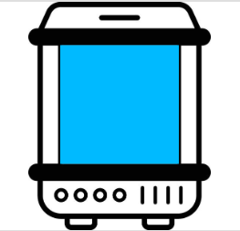

<!-- PROJECT LOGO -->
<br />
<div align="center">
  <a href="https://github.com/Tshetrim/Incubator">
    
  </a>

<h3 align="center">Incubator</h3>

  <p align="center">
    Automated Controllable IOT Lighting
    <br />
    <a href="#development"><strong>Explore the docs »</strong></a>
    <br />
    <br />
    <a href="https://qc-incubator.up.railway.app/esp32/dashboard">View Demo</a>
    ·
    <a href="https://github.com/Tshetrim/Incubator/issues">Report Bug</a>
    ·
    <a href="https://github.com/Tshetrim/Incubator/issues">Request Feature</a>
  </p>
</div>


<!-- TABLE OF CONTENTS -->
<details>
  <summary>Table of Contents</summary>
  <ol>
    <li>
      <a href="#about-the-project">About The Project</a>
    </li>
    <li><a href="#usage">Usage</a></li>
    <li><a href="#development">Development</a></li>
  </ol>
</details>


<!-- ABOUT THE PROJECT -->
## About The Project


Script for ESP32 using Arduino to connect to wifi as a client and request config data from heroku server as outlined in:

https://github.com/Tshetrim/HappyFish

To see the control portal:
https://qc-incubator.up.railway.app/esp32/dashboard 

*note: changes will only be saved if you login, see below for directions*


<p align="right">(<a href="#readme-top">back to top</a>)</p>


<!-- USAGE EXAMPLES -->
## Usage

**note: The term Incubator and ESP32 will be used interchangably here, the ESP32 is the microcontroller embedded within the incubator for this use case** 
### 1. Starting the Incubator (specific use case)
Once the Incubator is connected to the outlet, turn on the main switch then make sure the O/I light switch on the top is also switched towards the I
That will turn on the ESP32 which allows the light changing 
### 2. Connecting the Incubator (ESP32) to Wi-Fi    --- (only needs to be once, or if changing Wi-Fi)
    - Once the Incubator is on, the light will be RED for 60 seconds 
    - In that timeframe you can connect to the Incubator using a device such as a phone or laptop by going to the networks
        - Look for the Incubator's ssid: Incubator AP 
        - Press connect and enter the password: password
    - Once you connect to the Incubator, certain devices like an IPhone may immediately display the Wifi-Provisioning web portal, if not 
        - Goto a webrowser and type in: 
            http://192.168.4.1/
        - the web portal should load in (note the portal will likely be quite slow due to ESP32's hardware) 
            1. Press: Configure Wi-Fi
            2. A list of routers you can connect to will be scanned and displayed. 
            3. Click the SSID of the router you would like to connect to or type it in the SSID box
            4. Enter the password or leave blank if no password is needed (for our usecase, QCSecured and leave blank)
        - Once saved, the Incubator will close the web portal and attempt to connect to the router with the credientials put in 
        - The Incubator will be BLUE while trying to connect, then if successful, will turn GREEN
### 3. Controlling the Incubator 

#### Logging In to make changes: 
- Once the Incubator is connected to Wi-Fi, you can change its behavior by accessing the control dashboard by going to this website:

https://qc-incubator.up.railway.app/esp32
- Enter the password (to be sent separetely) and you will be able to make changes to the settings that will save 
- note make sure you are logged in for changes to save, if you read the message at the top, it will notify you if you are not logged in 

#### Setting Controls:  
    - Time: Once you can view the dashboard, the first thing to note is the Incubator is running on UTC TIME, the one outlined in a green box.
    - Day/Night cycle: You can change the start and end start times by typing in a number between 00:00 and 23:59 respectively 
    - Fade Duration: You can change the duration of the fade in and fade out by sliding the bar or entering a number in minutes 
        - Note fade in is when the light will gradually increase in brightness when allowing light, and fade out is gradually decreasing in blindness
        - To have no fade in/ fade out, simply set the duration to 0 
    - Color: Slide the RGB colors to change the color of the incubator

#### Other Important Notes: 
- The Incubator will always have the 60 second buffer on startup/restart where it will allow connections to change the Wi-Fi
- If already set before, simply let that timer run out and the Incubator will automatically connect to the wifi 
- When changing controls, it will take 10 SECONDS or less for the controls to actually reflect because the Incubator only checks for a change every 10 seconds 


<p align="right">(<a href="#readme-top">back to top</a>)</p>

<!-- Development -->
## Development
### 1. Getting Started with uploading
Download the ZIP file or do:
```git clone https://github.com/Tshetrim/Incubator.git```

Once files are installed to your desktop, open up an IDE for uploading scripts to ESP32. 
I used [VSCode](https://code.visualstudio.com/) with [PlatformIO Extension ](https://platformio.org/install/ide?install=vscode)

If new to development, I reccomend watching a tutorial on how to use and upload code to ESP32 with VSCode and PlatformIO like this [video](https://platformio.org/install/ide?install=vscode)
  Key Reminders:[Hold ESP32's Boot button while connecting to initiate upload](https://platformio.org/install/ide?install=vscode)

### 2. Note on Code and Architecture
TLDR: This entire system is HTTP driven. The ESP32 continously polls a backend endpoint for the settings and updates depending the returned data. HTTP with polling was chosen for easier fault-tolerance programming despite the higher overhead over something like MQTT/Websocket. 

The ESP32 is built to connect over wifi to a backend server. It continously asks the backend server for config data in relation to what light settings it should pick next. 

The backend server we're using is open source at [[here](https://github.com/Tshetrim/HappyFish/tree/main)] and an example of the response that is recieved from the fetch to the [endpoint](https://qc-incubator.up.railway.app/esp32/config) is:
```
{
  "_id": "62c5a11afe5e5cc5d093664b",
  "tod": 66365,
  "sunrise": 0,
  "sunset": 39660,
  "duration": 0,
  "rValue": 255,
  "gValue": 255,
  "bValue": 255,
  "__v": 0
}
```
The Incubator takes uses these values for adjusting its light settings. 

You can host your own backend api with an endpoint that returns data in this JSON format to make it work with this specific Incubator code, or adjust accordingly. 

A frontend dashboard like [this](https://qc-incubator.up.railway.app/esp32/dashboard) can then be used to modify the data that endpoint returns. 

<!-- MARKDOWN LINKS & IMAGES -->
<!-- https://www.markdownguide.org/basic-syntax/#reference-style-links -->
[contributors-shield]: https://img.shields.io/github/contributors/github_username/repo_name.svg?style=for-the-badge
[contributors-url]: https://github.com/Tshetrim/Incubator/graphs/contributors
[product-screenshot]: images/incubator-image.png
